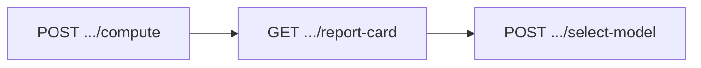

# Report Card — Frontend Integration Guide

> Ranked comparison of every computed regression variant for a calibration group.
> Use this to render the per-analyte model comparison table and persist the QA reviewer's pick.

---

## 🔐 Auth & Scope

| Requirement | Detail |
|---|---|
| **Header** | `Authorization: Bearer <jwt>` on every request |
| **Lab users** | Scoped automatically from the token |
| **Platform / operator users** | Must append `?laboratoryId=<uuid>` (no lab claim in token) |

---

## 🔄 Call Sequence

The report card **only exists after regression runs**. Follow this order:



| Step | Endpoint | Permission | Notes |
|---|---|---|---|
| 1. Compute | `POST /api/calibration-groups/{id}/compute` | `perm.runs.upload` | Runs all regression/weighting variants. Clears prior selections. |
| 2. Read card | `GET /api/calibration-groups/{id}/report-card` | `perm.view` | The data you render. |
| 3. Persist pick | `POST /api/calibration-groups/{id}/analytes/{analyteId}/select-model` | `perm.groups.approve` | Saves the reviewer's chosen model. |

---

## 📥 `GET /api/calibration-groups/{id}/report-card`

| Status | Meaning |
|---|---|
| `200` | `CalibrationGroupReportCardDto` (see below) |
| `409` | Group not computed yet → run compute first |
| `404` | Group missing or outside your lab scope |

### Top-level shape

```jsonc
{
  "isComputationStale": false,        // true = data changed since compute → recompute before sign-off
  "variants": [ /* ReportCardVariantDto */ ],
  "analyteRecommendations": [ /* best model per analyte */ ],
  "analyteSelections": [ /* current QA-selected model per analyte */ ]
}
```

---

### `variants[]` — one per regression variant (ordered best → worst)

```jsonc
{
  "regressionType": "Linear",      // Average | Linear | LinearForcedZero | Quadratic | QuadraticForcedZero
  "weightingMode": "InverseX",     // None | InverseX | InverseXSquared
  "reportCardScore": 12,           // # analytes passing in this variant
  "totalAnalytes": 14,
  "isSuggestedModel": true,        // true only on the top-ranked variant
  "analytes": [ /* ReportCardAnalyteDto */ ]
}
```

---

### Full row mapping (Excel BB–BU ↔ DTO field)

Each Excel block = 1 analyte, 9 rows (one per model). `variants[9].analytes[]` is the same 9 models, transposed.

| Excel col | Excel header | DTO field | Scope |
|---|---|---|---|
| BB | analyte / model name | `analyteName` + `variants[].modelLabel` | top-level |
| BC | RSD | `rankingBreakdown.rsdPassGate` (1/100) / `rsdGrade` (A+/F) | Average row only |
| BD | r | `correlationRGrade` (A+/F) | all 9 rows |
| BE | COD | `codGrade` (A+/F) | all 9 rows |
| BF | # pts PE% < -20% | `rankingBreakdown.pointsBelowLowerBound` | raw count |
| BG | # pts PE% > 20% | `rankingBreakdown.pointsAboveUpperBound` | raw count |
| BH | total # pts fail | `rankingBreakdown.failTotalDoubleCounted` | raw count |
| BI–BM | probe ranks (0%, 12.5%, 25%, 50%, 75%) | `rankingBreakdown.probeDeviationRanks[0..4]` | ranks |
| BN | overall extrapolation rank | `rankingBreakdown.overallDeviationRank` | rank |
| BO | negative area rank | `rankingBreakdown.negativeAreaRank` | rank |
| BP | ICV rank | `rankingBreakdown.icvRank` | rank |
| BR | Point Total | `pointTotal` | all 9 rows |
| BS | Point Total Ranking | `modelRank` | all 9 rows |
| BT | Point Total w/o forced 0 | `nonForcedZeroPointTotal` | blank on 2 forced-zero rows |
| BU | Point Total w forced 0 | `nonForcedZeroModelRank` | blank on 2 forced-zero rows |
| AR | CC (r) | `correlationR` | raw value |
| AS | COD (r²) | `rSquared` | raw value |

Picker cells (below the 9 rows):

| Excel cell | DTO field |
|---|---|
| BH64 "Best overall ranked" | `analyteRecommendations[].recommendedModelLabel` (or `cautionText` if quadratic-inverse) |
| BH65 "Best ranked non-forced 0" | `analyteRecommendations[].nonForcedZeroModelLabel` (or `cautionText`) |

Column headers (row 35/36, same for every block):

| Excel | DTO |
|---|---|
| RSD header | `rsdThresholdLabel` |
| r header | `correlationRThresholdLabel` |
| COD header | `codThresholdLabel` |

To render one full Excel model row: pull `variants[i].modelLabel` + that variant's `analytes[]` entry for the target analyte, and read straight down the table above.

---

### `variants[].analytes[]` — per-analyte diagnostics (`ReportCardAnalyteDto`)

```jsonc
{
  "analyteId": "uuid",
  "analyteName": "Benzene",
  "modelLabel": "LS (Inv conct)",  // optional display label for this row (falls back to local REPORT_CARD_MODEL_ORDER)
  "calStatus": "Pass",             // Pass | Fail
  "failureReasons": ["..."],
  "rSquared": 0.998,              // COD raw value (AS) — coefficient of determination
  "correlationR": 0.999,          // r raw value (AR)
  "rse": 4.2,                     // residual standard error — NOT the RSD column
  "correlationRGrade": "A+",      // BD — preferred over local threshold math
  "codGrade": "A+",               // BE — preferred over local threshold math
  "includedPointCount": 8,
  "missedPointCount": 0,
  "icvPassed": true,
  "pointTotal": 14,                // BR — composite demerit score — LOWER IS BETTER
  "modelRank": 1,                  // BS — 1 = best variant for this analyte
  "nonForcedZeroPointTotal": 14,   // BT — null on the 2 forced-zero rows
  "nonForcedZeroModelRank": 1,     // BU — null on the 2 forced-zero rows
  "negativeAreaPenalty": 0,
  "isRecommendedModel": true,      // lowest pointTotal overall (may be forced-zero)
  "isRecommendedNonForcedZeroModel": false,
  "rankingBreakdown": { /* addends that sum to pointTotal, plus RSD gate */ }
}
```

**Fit-quality columns (Excel ↔ UI ↔ API)**

| Excel col | UI column | API field | Grade rule |
|---|---|---|---|
| BC | RSD | `rankingBreakdown.rsdPassGate` (or `rsdGrade`) | `1` → `A+`, `100` → `F`, `null` → `—` (Average RF row only) |
| BD | r | `correlationRGrade` | API-provided letter; local fallback only if missing: `correlationR` ≥ `0.995` → `A+` |
| BE | COD | `codGrade` | API-provided letter; local fallback only if missing: `rSquared` ≥ `0.900025` → `A+` |
| AR | — (tooltip) | `correlationR` | raw r value |
| AS | — (tooltip) | `rSquared` | raw COD value |

> ⚠️ Do **not** grade RSD from `rse` or from `passGate`. `rse` is residual standard error. `passGate` is the Point-Total primary criterion (RSD for Average RF; r/COD otherwise). The workbook BC letter is only `rsdPassGate`, and the API leaves it `null` on non–Average-RF rows.
> ⚠️ Do **not** grade r/COD from a single shared threshold. They are different cutoffs (`0.995` vs `0.900025`) and, when the API sends `correlationRGrade`/`codGrade` directly, those letters win — local math is a fallback only.

---

### `rankingBreakdown` — the columns behind `pointTotal`

```
pointTotal = passGate
           + pointsBelowLowerBound
           + pointsAboveUpperBound
           + failTotalDoubleCounted
           + probeDeviationRankSum
           + overallDeviationRank
           + negativeAreaRank
           + icvRank
```

| Excel col | Field | Meaning |
|---|---|---|
| — | `passGate` | `1` if primary criterion passes, else `100` (RSD for Average RF; r/COD otherwise) |
| — | `primaryCriterion` | `Rsd` \| `CorrelationR` \| `RSquared` — which gate fed `passGate` |
| BC | `rsdPassGate` | Workbook BC: `1`/`100` for Average RF only; `null` on other models (RSD column blank) |
| — | `responseFactorRsd` | RF %RSD used by the Average gate; `null` on other models |
| BF | `pointsBelowLowerBound` | Included points outside the %Diff band — **raw count**, not a rank |
| BG | `pointsAboveUpperBound` | Included points outside the %Diff band — **raw count**, not a rank |
| BH | `failTotalDoubleCounted` | below + above, counted a second time (workbook double-count) — **raw count**, not a rank |
| BI–BM | `probeDeviationRanks[0..4]` | int array, probe-ladder order: `zero, 12.5%, 25%, 50%, 75%` (1 = best) — these **are** ranks |
| — | `probeDeviationRankSum` | sum of the array above |
| BN, BO, BP | `overallDeviationRank`, `negativeAreaRank`, `icvRank` | ascending ranks vs sibling variants (1 = best) |

> ⚠️ BF/BG/BH are raw counts that get summed directly into `pointTotal` — do **not** rank them against sibling models. Only BI–BP are ranks.
> ⚠️ `rankingBreakdown` is `null` when a variant couldn't be ranked (e.g. no low-level probe ladder).

---

### `analyteRecommendations[]` — the "best pick" per analyte

```jsonc
{
  "analyteId": "uuid",
  "analyteName": "Benzene",
  "recommendedRegressionType": "Linear",
  "recommendedWeightingMode": "InverseX",
  "recommendedModelLabel": "LS (Inv conct)",   // BH64 text — preferred over building from RT/WM
  "recommendedPointTotal": 14,
  "nonForcedZeroRegressionType": "Linear",
  "nonForcedZeroWeightingMode": "InverseX",
  "nonForcedZeroModelLabel": "LS (Inv conct)", // BH65 text
  "quadraticInverseCaution": false,            // true → whichever pick is quadratic-inverse shows cautionText
  "cautionText": null                          // "check instrument COD" style message; overrides the label when set
}
```

> BH64 ("Best overall ranked") and BH65 ("Best ranked non-forced 0") should render `recommendedModelLabel` / `nonForcedZeroModelLabel` directly. If `cautionText` is present (or `quadraticInverseCaution === true` with no text), show it alongside whichever pick is the quadratic inverse-weighted one.

### Column header labels (row 35/36 — same for every analyte block)

```jsonc
{
  "rsdThresholdLabel": "RSD < 15%",
  "correlationRThresholdLabel": "r > 0.995",
  "codThresholdLabel": "COD > 0.900025"
}
```

Top-level on the report card payload (not per-variant/per-analyte). Render these as the sub-header text over the RSD/r/COD columns instead of hardcoding "RSD"/"r"/"COD"; default to those plain labels when absent.

### `analyteSelections[]` — current QA choice per analyte

```jsonc
{
  "analyteId": "uuid",
  "analyteName": "Benzene",
  "regressionType": "Linear",
  "weightingMode": "InverseX"
}
```

---

## 💾 Persist a Selection

```http
POST /api/calibration-groups/{id}/analytes/{analyteId}/select-model
Content-Type: application/json

{ "regressionType": "Linear", "weightingMode": "InverseX" }
```

- **`204 No Content`** on success
- Requires `perm.groups.approve`; group must be `Computed` and **not** stale
- Selections are cleared on every recompute

---

## 🎨 Rendering Rules

- 🏌️ **Lower `pointTotal` wins** (golf scoring). `modelRank == 1` / `isRecommendedModel` = the winner.
- 0️⃣ **Forced-zero variants compete fully.** A `null` `pointTotal` means *unrankable*, **not** *excluded*.
- 🔵🔴 Show **both** `isRecommendedModel` (best overall) and `isRecommendedNonForcedZeroModel` (best non–through-origin) — some labs disallow forced-zero fits.
- ⚠️ If `isComputationStale === true`, warn the user to recompute before sign-off.

---

## 🎨 Table Color Scheme

The colors are **semantic** — they encode meaning, not decoration. Source: `rankCellClass()` / `gradeCellClass()` / `REPORT_CARD_MODEL_ORDER` in `src/lib/report-card-excel.ts`.

### Rank cells (1 = best → 9 = worst)

A traffic-light gradient. Applied to every ranked column (BI–BP low-cal probes/overall/negative-area/ICV, plus the Point-Total rank and `nonForcedZeroModelRank`). **Not** applied to BF/BG/BH — those are raw counts, rendered as plain numbers.

| Rank | Meaning | Light class | Tone |
|---|---|---|---|
| `1–2` | Best | `bg-emerald-200 text-emerald-950` | 🟢 Green |
| `3–4` | Good | `bg-lime-100 text-lime-950` | 🟩 Lime |
| `5–6` | Middling | `bg-amber-100 text-amber-950` | 🟡 Amber |
| `7–8` | Weak | `bg-orange-200 text-orange-950` | 🟠 Orange |
| `9` | Worst | `bg-red-200 text-red-950` | 🔴 Red |
| `null` | Unranked (—) | `bg-neutral-100` | ⚪ Gray |

> Dark mode uses the matching `dark:bg-*-900/50` variants. The **Point total** cell itself is shaded by its *rank* via the same scale.

### Fit-quality grade cells (RSD, r, COD)

| Grade | Meaning | Class | Tone |
|---|---|---|---|
| `A+` | Pass | `bg-white font-semibold text-neutral-900` | ⚪ White |
| `F` | Fail | `bg-yellow-300 font-semibold text-red-800` | 🟨 Yellow / red text |
| `—` | N/A | `bg-neutral-50 text-neutral-500` | ⚪ Muted gray |

### Model row labels (left column — fixed per variant)

Each of the 9 calibration models has a signature color so a row is recognizable at a glance:

| Model (Excel label) | Class | Tone |
|---|---|---|
| Average RF | `bg-blue-600 text-white` | 🔵 Blue |
| LS (EW) | `bg-purple-700 text-white` | 🟣 Purple |
| LS (Inv conct) | `bg-cyan-400 text-neutral-900` | 🩵 Cyan |
| LS (Inv Sqd) | `bg-orange-400 text-neutral-900` | 🟠 Orange |
| LS (Forced 0) | `bg-lime-700 text-white` | 🟢 Lime |
| Quad (EW) | `bg-green-400 text-neutral-900` | 🟩 Green |
| Quad (Inv Conct) | `bg-orange-600 text-white` | 🟧 Dark orange |
| Quad (Inv Sqd) | `bg-yellow-300 text-neutral-900` | 🟡 Yellow |
| Quad (Forced 0) | `bg-sky-300 text-neutral-900` | 🩵 Sky |

### Structural / state colors

| Element | Class | Meaning |
|---|---|---|
| Table title & footer | `bg-lime-200` / `bg-lime-100` | Section chrome |
| Header rows | `bg-neutral-100` / `bg-neutral-50` | Column groups |
| **Selected row** | `ring-2 ring-inset ring-emerald-500` | The QA-chosen model |
| Footer — best overall | `text-blue-700` | 🔵 Recommended (may be forced-zero) |
| Footer — best non-forced-0 | `text-red-700` | 🔴 Recommended through-non-origin |

> 💡 Quick read for reviewers: **greener = better, redder = worse**; grades are **white = pass, yellow = fail**; **blue footer** = best overall pick, **red footer** = best non-forced-zero pick.

---

## 📚 Enums

| Enum | Values |
|---|---|
| `RegressionType` | `Average`, `Linear`, `LinearForcedZero`, `Quadratic`, `QuadraticForcedZero` |
| `WeightingMode` | `None`, `InverseX` (1/x), `InverseXSquared` (1/x²) |
| `AnalyteCalStatus` | `Pass`, `Fail` |

---

## 🗂 Reference (existing codebase)

| Concern | Location |
|---|---|
| API wrapper | `getCalibrationGroupReportCard()` — `src/lib/api/wltr-api.ts:485` |
| Normalizer / table builder | `buildReportCardTables()` — `src/lib/report-card-excel.ts` |
| Rendered UI | `src/components/calibration-group-report-card-table.tsx` |
| Fixed 9-row model order | `REPORT_CARD_MODEL_ORDER` — `src/lib/report-card-excel.ts` |

> The frontend renders a **fixed 9-row model order** per analyte (Average RF; LS EW/InvX/InvX²; LS Forced-0; Quad EW/InvX/InvX²; Quad Forced-0). API `variants` are matched into those rows by `(regressionType, weightingMode)`; missing variants render as empty rows.
